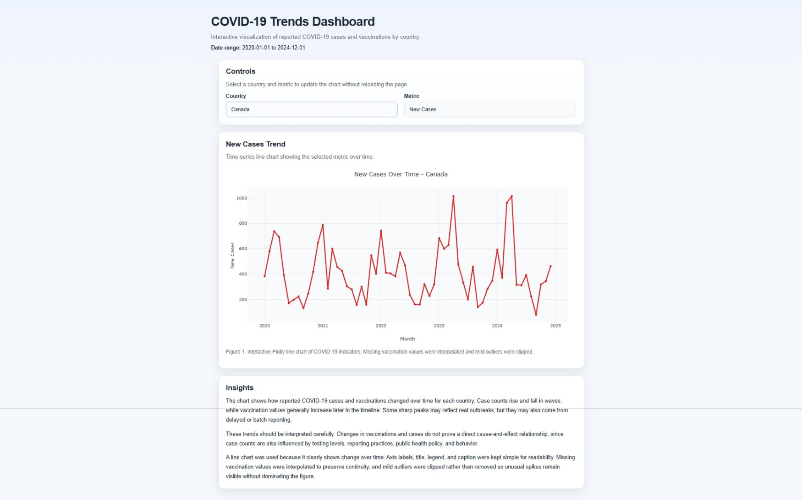
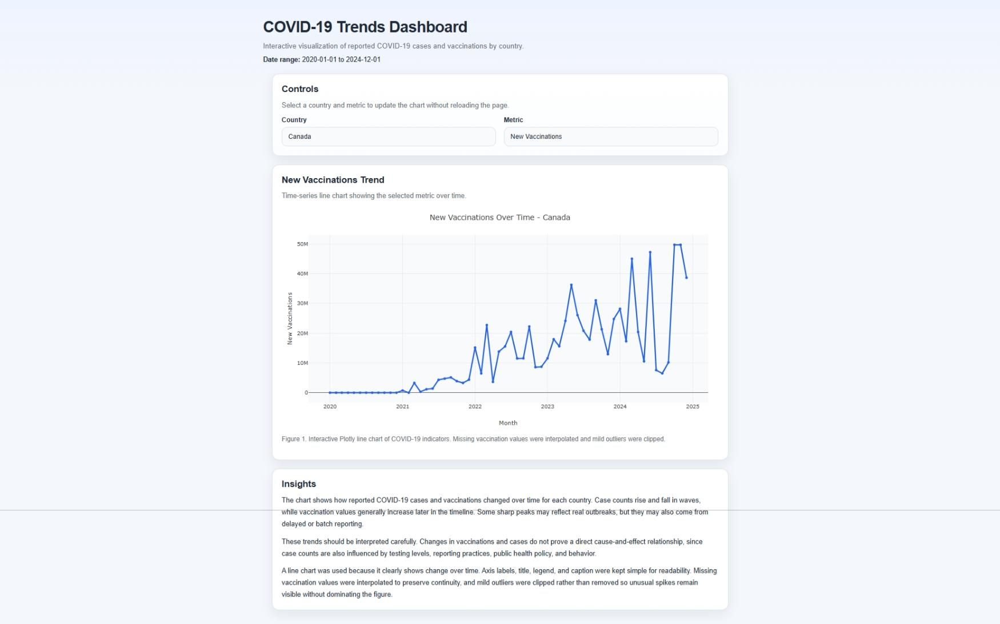
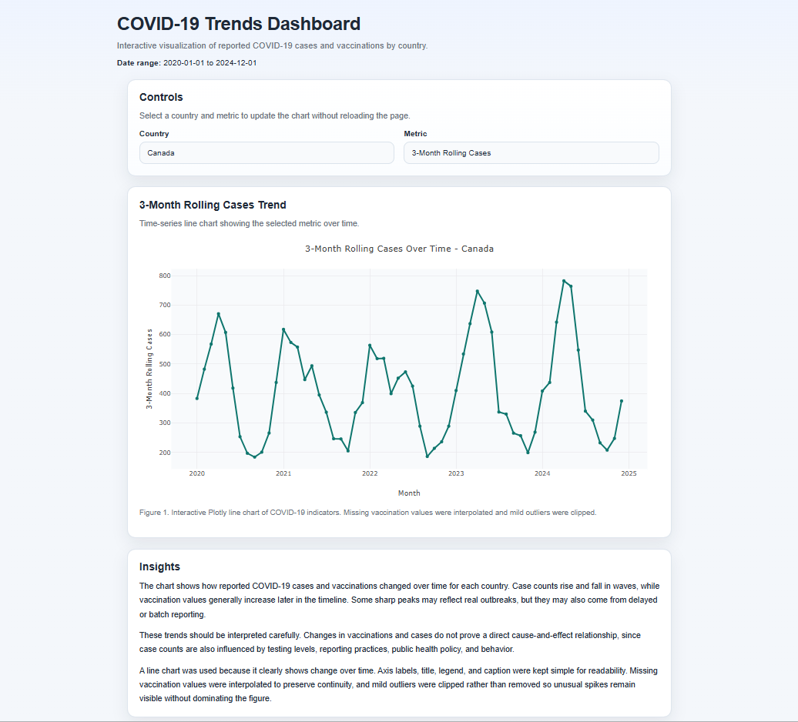

# COVID-19 Webapp

- **Install requirements**
- Python 3.10+
- `pip` (Python package installer)
- Install dependencies:
  - `pip install flask pandas`

- **Launch the site**
- Open a terminal in `klas2164_a04`
- Start the Flask app:
  - `python app.py`
- Open your browser to:
  - `http://127.0.0.1:5001`

## Previews

Here is a look at the layout and dynamic data components of the COVID-19 Data Visualization Dashboard:

### Regional Infection Trends

### Vaccination Distribution Progress

### Rolling Averages & Statistical Analysis
